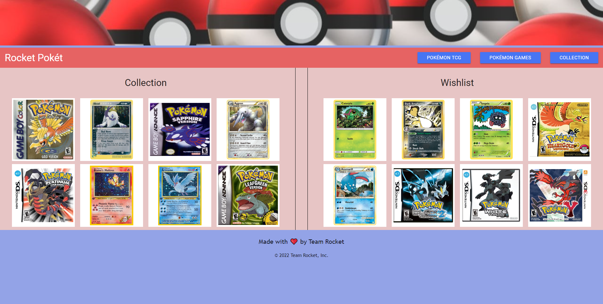

# Rocket Poket

## Description
The world of pokemon is all about collecting them all.  We made a site that helps keep track of that. Though 26 years and 8 generations of Pokemon, the things you can collect for pokemon is massive!  So where do we start? Rocket Poket of course!

## Language and Technologies
* HTML
* CSS
* Javascript
* Jquery
* PokeAPI.co & Pokemontcg.io

## Team Members
* [Lydia Kim](https://github.com/lydiakim10)

* [Ashley Yu](https://github.com/hiashley)

* [Brian Hoang](https://github.com/brianthoang)

* [Dat Nguyen](https://github.com/Crestatic)

## Link to Website
https://lydiakim10.github.io/Rocket-Poket/

## Screenshots
### Homepage

### Pokemon TCG

### Pokemon Games

### Collection & Wishlist

